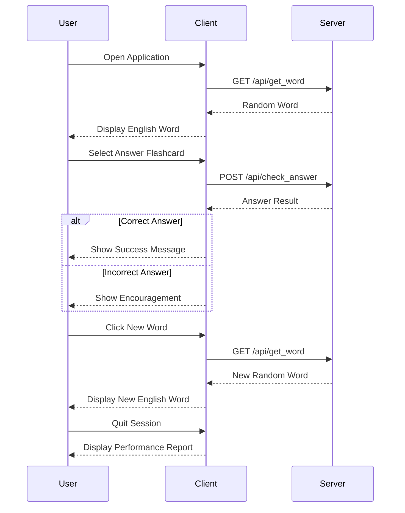

# VocabFlashcard TS

This is a TypeScript-based application of the VocabFlashcard.

## Project Structure

- `package.json`: Contains the project dependencies and scripts.
- `tsconfig.json`: TypeScript configuration file.
- `vite.config.ts`: Vite configuration file managing server interactions.

## Installation

1. Install dependencies:

   ```bash
   npm install
   ```

2. Start the server:
   ```bash
   npm start
   ```

## API Endpoints

- `GET /get_word`: Fetch a random word from the database.
- `POST /check_answer`: Check if the provided answer is correct.

## Database

Ensure that the `JapaneseDB.db` SQLite database is present in the project root.

## Functionality

- Fetch random words from the database.
- Check user answers against the correct Kanji and Romaji.
- store correct word information in database
- Store user progress in session variables, including consecutive correct answers and performance data.

## New Features

### Badge of Excellence

- The application now tracks the number of consecutive correct answers.
- Users receive a "Badge of Excellence" and a happy animation when they answer three words correctly in a row.

### Performance Report

- Users can view a performance report upon quitting the session.
- The report includes words answered correctly and incorrectly during the session.

## Detailed Functionality

### Application Flow

1. **Initialization**: When the application starts, it initializes the React component and fetches a random word from the server.

   - **File**: `src/client.tsx`
   - **Function**: `fetchWord`
   - **Description**: This function makes an API call to `/api/get_word` to retrieve a random word. It updates the state with the fetched word details.

2. **Displaying the Word**: The English word is displayed on a flashcard.

   - **File**: `src/client.tsx`
   - **Function**: React component rendering
   - **Description**: The flashcard shows the English word initially. Clicking on it toggles the display to show Kanji and Romaji.

3. **User Interaction**: The user selects their answer from 4 flashcards.

   - **File**: `src/client.tsx`
   - **Function**: `checkAnswer`
   - **Description**: Clicking on a flashcard submits the user's answer to `/api/check_answer` and receives feedback on correctness.

4. **Feedback and Next Steps**: Depending on the correctness of the answer, feedback is displayed, and the user can proceed to the next word.

   - **File**: `src/client.tsx`
   - **Function**: State updates and rendering logic
   - **Description**: If the answer is correct, a success message is shown, and the input is disabled. If incorrect, the user is encouraged to try again.

5. **Badge and Report**: New logic to handle badges and performance reports.
   - **File**: `src/client.tsx`
   - **Function**: New session management logic
   - **Description**: Tracks consecutive correct answers and generates performance report upon quitting.

### Sequence Diagram



This sequence diagram illustrates the interaction between the user, client, and server components of the Vocab Flashcard application.
